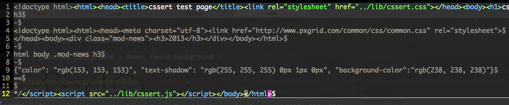

# CSSのテスト

[@GeckoTang](http://twitter.com/GeckoTang)

---

## CSSのテストって何するの？

- CSSが正しく書かれているかのテスト
- ある部分を変更して、それ以外の部分に影響が出てないかのテスト
- Sassとかで作った@functionが正しい値を返しているかのテスト

---

## テスト方法は？

- CSSの値チェック
- 画像比較
- Sassの@functionをテスト

---

## CSSの値チェック

間違ったCSSが書かれていないかをLintしたり、

指定した要素に正しい値か適用されてるかをテストする。

- [Cactus](https://github.com/winston/cactus)
- [CSSunit](https://github.com/gagarine/CSSunit)
- [CSS Lint](http://csslint.net/)
- [cssert](https://github.com/thingsinjars/cssert)

-v-

### Cactus

.headerのfont-sizeが24pxかどうかをチェック

```javascript
Cactus.expect(".header", "font-size").toEqual("24px");
```

-v-

### CSSunit

h2のcolorがrgb(0, 128, 0)と同じかをチェック

```
var actual = $('h2').css('color');
module('Simple CSS');
test("title color blue", 1, function() {
  same( actual, 'rgb(0, 128, 0)', 'message' );
});
```

-v-

### CSS Lint

propertyやvalueに不正がないかをチェック

```css
nav { paddling: 250px; }
nav ul { background: #red; }
```

```sh
$ csslint test.css
csslint: There are 3 problems in test.css.

test.css
1: warning at line 5, col 3
Unknown property 'paddling'.
  paddling: 250px;

test.css
2: warning at line 7, col 1
Rule is empty.
nav ul {

test.css
3: error at line 8, col 15
Expected a hex color but found '#red' at line 8, col 15.
  background: #red;
```

-v-

### cssert

pxgrid.comのh3が[base.css](http://www.pxgrid.com/common/css/base.css)の内容が反映されているかをチェック



```sh
$ ./cssert testcases.html
--
h3 : Passed
```

---

## 画像比較系

何かアクション(CSSの変更、要素をクリックなど)を

起こす前と起こした後の画像を比較します

- [PhantomCss](https://github.com/Huddle/PhantomCSS)
- [Hardy](http://hardy.io/)
- [CSSCritic](http://csste.st/tools/csscritic.html)

-v-

### PhantomCSS

```
デモ
```

-v-

### Hardy

```
デモ
```

-v-

### CSS Critic

```
デモ
```

---

## Sassの@functionをテスト

- [true](https://github.com/ericam/true)
- [bootcamp](https://github.com/tctcl/bootcamp) 

-v-

### true

```
デモ
```

-v-

### bootcamp

```
デモ
```

---

## まとめ

- まだまだ発展途上なCSS(手動||自動)テスト
- 複雑なWebアプリケーションならやってもいいかも
- 簡単なウェブページは必要なさそう
- @functionのテストは実用的かも（そこまで複雑な@functionを書くかは置いておいて）
- テストするためにも綺麗なコメントの入れ方が必要になりそう（jsDocToolkit的な）

---

## 参考

- [csste.st](http://csste.st/tools/)
- [4 tools for automatic CSS](http://www.creativebloq.com/css3/4-tools-automatic-css-testing-7133777)
- [Automatic CSS Testing](http://css-tricks.com/automatic-css-testing/)
